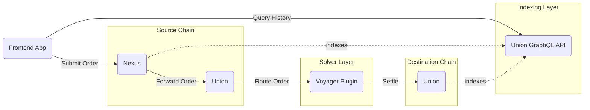

# Architecture

We will refer to our exchange as `Nexus`, since Nex rhymes with Dex, it is short and memeable.
From a high level, our project will function approximately like so:

We will focus on how to submit orders to `Nexus`, call the Union solidity API, and track order fullfilment. Finally we shall implement a `Voyager` plugin to
specifically solve for our protocol.

## Requirements

Our app will focus on two core operations:

- Swaps: Trade between any ERC20 tokens supported by our solvers
- Bridge: Move assets between supported chains, with the ability to swap during the bridge

Each operation will maintain comprehensive historical data tracking user trades, token amounts, prices at execution time, and transaction status. This data will be used for:

- Displaying trade history
- Calculating PnL across chains
- Analyzing user trading patterns

## Swaps

For our swaps, we will for now not rely on liquidity pools directly. Instead we will assume that our solver manages inventory efficiently. The solver may
integrate with DEXes and choose to leverage centralized exchanges too.

## Bridge

Our bridge functionality is simple: we will allow a user to select what chain to start at, and which chain to end at.
Since we are building a multichain exchange, we will not allow swaps without bridging for now, although that will be relatively trivial to add.

## Historic data

We will query the Union graphql API for data related to our contracts and users. For now we do not store them in another database, although if
we want to do advanced analysis, that'd be the next step.
