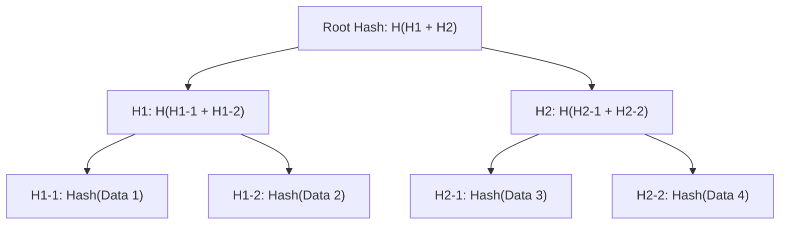

# Inclusion Proofs

Now that we understand how to verify blocks using a light client, we will show how based on these verified blocks, we can verify state proofs, and in extension of that, messages and transfers. We will explore how to efficiently prove that a piece of data is included in a larger dataset without needing to reveal or access the entire dataset.

## Merkle Trees

A Merkle tree (or hash tree) is a data structure that allows for efficient and secure verification of content in a large body of data. Named after Ralph Merkle, who patented it in 1979, these trees are fundamental building blocks in distributed systems and cryptographic applications.

### Structure of a Merkle Tree

A Merkle tree is a binary tree where:

- Each leaf node contains the hash of a data block
- Each non-leaf node contains the hash of the concatenation of its child nodes

Let's visualize a simple Merkle tree with 4 data blocks:



In this diagram:

1. We start with four data blocks: Data 1, Data 2, Data 3, and Data 4
1. We compute the hash of each data block to create the leaf nodes (H1-1, H1-2, H2-1, H2-2)
1. We then pair the leaf nodes and hash their concatenated values to form the next level (H1, H2)
1. Finally, we concatenate and hash the results to get the root hash

The root hash uniquely represents the entire dataset. If any piece of data in the tree changes, the root hash will also change. Root hashes are present in block headers for most blockchains. Ethereum for example has the`state_root` field in each header. With the state root, we can construct a proof for any data stored on Ethereum, so whenever we write value V to storage in a solidty smart contract at block H, we can construct a proof to show that from H onwards, that slot contains V. This proof will be valid until we update or delete the value.

```python
def prove(state_root, proof, V) -> Boolean
```

For Merkle trees specifically, we construct Merkle Inclusion proofs. Constructing the proof is relatively compute intensive and requires access to the full state and history, so only archive nodes are capable of doing so.

## Inclusion Proofs

An inclusion proof (also called a Merkle proof) is a way to verify that a specific data block is part of a Merkle tree without having to reveal the entire tree.

An inclusion proof consists of:

1. The data block to be verified
1. A "proof path" - a list of hashes that, combined with the data block's hash in the right order, will reproduce the root hash

Let's visualize how a Merkle proof works for Data 2 in our example:

In this visualization, we're proving that Data 2 is included in the tree. The pink node is the data we're proving (Data 2), and the blue nodes represent the proof path hashes we need.

The proof for Data 2 consists of:

- The data itself: Data 2
- The proof path: \[H1-1, H2\]


To verify that Data 2 is indeed part of the Merkle tree with root hash R, a verifier would:

1. Compute H1-2 = Hash(Data 2)
1. Compute H1 = Hash(H1-1 + H1-2) using the provided H1-1
1. Compute Root = Hash(H1 + H2) using the provided H2
1. Compare the computed Root with the known Root hash

If they match, it proves Data 2 is part of the tree. Effectively we recompute the state root lazily.

For a Merkle tree with n leaves, the proof size and verification time are both O(log n), making it highly efficient even for very large datasets.

For example, in a tree with 1 million leaf nodes:

- A full tree would require storing 1 million hashes
- A Merkle proof requires only about 20 hashes (log₂ 1,000,000 ≈ 20)

## Message Verification using Inclusion Proofs

Now that we have a clearly defined model on how to get blocks from chain `source` on chain `destination` using a [light client](./ethereum.md), and how to prove state from `source` on `destination` using `source`'s state root, we will show a simple model on how to securely perform cross chain messaging using a state proof.

First, we need to write our message to a known storage location on the source chain. This is typically done through a smart contract:

```solidity
// On source chain
contract MessageSender {
    // Maps message IDs to actual messages
    mapping(uint256 => bytes) public messages;

    // Event emitted when a new message is stored
    event MessageStored(uint256 indexed messageId, bytes message);

    function sendMessage(bytes memory message) public returns (uint256) {
        uint256 messageId = hash(message)
        messages[messageId] = message;
        emit MessageStored(messageId, message);
        return messageId;
    }
}
```

When `sendMessage` is called, the message is stored in the contract's state at a specific storage slot that can be deterministically calculated from the messageId.

Next, we need to update the light client on the destination chain to reflect the latest state of the source chain:

```solidity
// On destination chain
contract LightClient {
    // Latest verified block header from source chain
    BlockHeader public latestHeader;

    function updateBlockHeader(BlockHeader memory newHeader, Proof memory proof) public {
        // Verify the proof that newHeader is a valid successor to latestHeader
        require(verifyProof(latestHeader, newHeader, proof), "Invalid block proof");

        // Update the latest header
        latestHeader = newHeader;
    }

    function getStateRoot() public view returns (bytes32) {
        return latestHeader.stateRoot;
    }
}
```

The light client maintains a record of the latest verified block header, which includes the state root of the source chain. Regular updates to this light client ensure that the destination chain has access to recent state roots.

Finally, we can prove the existence of the message on the destination chain using a Merkle inclusion proof against the state root:

```solidity
// On destination chain
contract MessageReceiver {
    LightClient public lightClient;
    address public sourceSenderContract;

    constructor(address _lightClient, address _sourceSender) {
        lightClient = LightClient(_lightClient);
        sourceSenderContract = _sourceSender;
    }

    function verifyAndProcessMessage(
        uint256 messageId,
        bytes memory message,
        bytes32[] memory proofNodes,
        uint256 proofPath
    ) public {
        // Get the latest state root from the light client
        bytes32 stateRoot = lightClient.getStateRoot();

        // Calculate the storage slot for this message in the source contract
        bytes32 storageSlot = keccak256(abi.encode(messageId, uint256(1))); // Slot for messages[messageId]

        // Verify the inclusion proof against the state root
        require(
            verifyStorageProof(
                stateRoot,
                sourceSenderContract,
                storageSlot,
                message,
                proofNodes,
                proofPath
            ),
            "Invalid state proof"
        );

        // Message is verified, now process it
        processMessage(messageId, message);
    }

    function processMessage(uint256 messageId, bytes memory message) internal {
        // Application-specific message handling
        // ...
    }

    function verifyStorageProof(
        bytes32 stateRoot,
        address contractAddress,
        bytes32 slot,
        bytes memory expectedValue,
        bytes32[] memory proofNodes,
        uint256 proofPath
    ) internal pure returns (bool) {
        // This function verifies a Merkle-Patricia trie proof
        // It proves that at the given storage slot in the specified contract,
        // the value matches expectedValue in the state with stateRoot

        // Implementation details omitted for brevity
        // This would use the proofNodes and proofPath to reconstruct the path
        // from the leaf (storage value) to the state root

        return true; // Placeholder
    }
}
```

This mechanism ensures that messages can only be processed on the destination chain if they were genuinely recorded on the source chain, without requiring trust in any intermediaries. The security of the system relies on:

1. The integrity of the light client, which only accepts valid block headers
1. The cryptographic properties of Merkle trees, which make it impossible to forge inclusion proofs
1. The immutability of blockchain state, which ensures the message cannot be altered once written

By combining light client verification with state inclusion proofs, we establish a trustless bridge for cross-chain communication that maintains the security properties of both blockchains.
