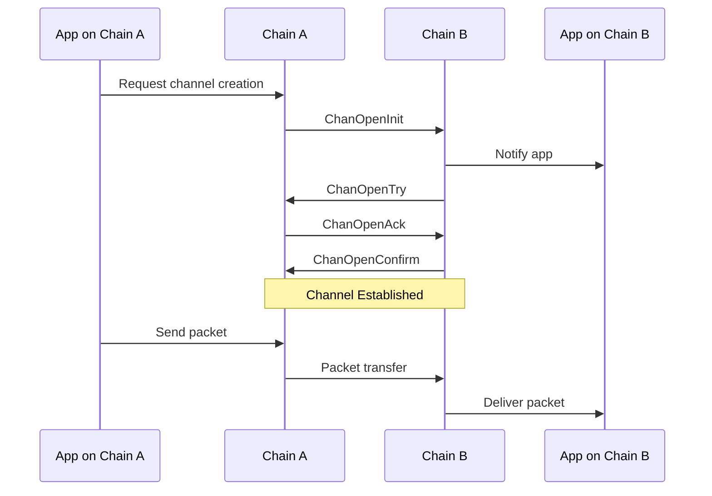

# Channels

Channels provide an application-level communication protocol built on top of connections. While connections handle the basic secure transport between chains, channels implement message delivery and application-specific logic. Think of channels as dedicated message queues between specific applications on different chains, where messages are typed and have certain effects.

Each channel has key properties:

- Ordering: Controls packet delivery (ordered, unordered, or ordered with timeouts)
- Version: Application-specific string for protocol versioning
- State: Tracks the channel establishment process

The channel handshake ensures both applications:

1. Agree on the version
1. Are ready to process packets
1. Can verify each other's packet commitments

Multiple channels can exist over a single connection, each serving different applications. For example, a token transfer application and a governance application could each have their own channel while sharing the underlying secure connection. In general, Union multiplexes traffic over connections and only maintains one connection per chain, while operating many different channels.
