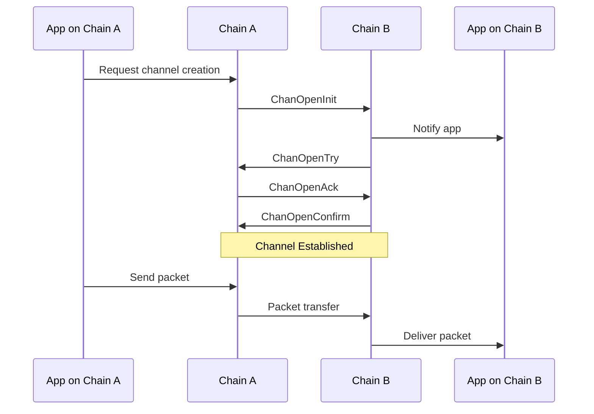
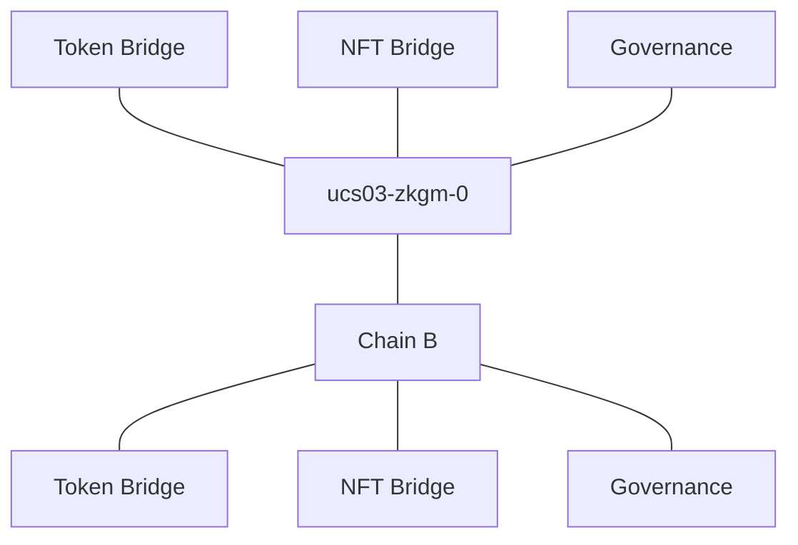

# Channels

Channels provide an application-level communication protocol built on top of connections. While connections handle the basic secure transport between chains, channels implement message delivery and application-specific logic. Think of channels as dedicated message queues between specific applications on different chains, where messages are typed and have certain effects.



Each channel has key properties:

- Ordering: Controls packet delivery (ordered, unordered, or ordered with timeouts)
- Version: Application-specific string for protocol versioning
- State: Tracks the channel establishment process

The channel handshake ensures both applications:

1. Agree on the version
1. Are ready to process packets
1. Can verify each other's packet commitments

Multiple channels can exist over a single connection, each serving different applications. For example, a token transfer application and a governance application could each have their own channel while sharing the underlying secure connection. In general, Union multiplexes traffic over connections and only maintains one connection per chain, while operating many different channels.

## Channel Usecases

Whenever a protocol has a structured message format, it should consider using a specific channel. This is useful for indexers, which use `channel.version` to read packets for further analysis.

We can query active channels by running:

<div class="tab">
  <button class="tablinks" onclick="openTab(event, 'Command')">Fetch Channels</button>
  <button class="tablinks" onclick="openTab(event, 'Nix')">Nix</button>
</div>

<div id="Command" class="tabcontent">

```bash
gq https://development.graphql.union.build/v1/graphql -q '
{{ #shiftinclude auto:../queries/channels.graphql }}
'
```

</div>

<div id="Nix" class="tabcontent">

```bash
nix shell nixpkgs#nodePackages.graphqurl
```

</div>

You will probably see `ucs03-zkgm-0` in the output, which is the multiplexed transfer protocol. Like a swiss-army knife, it works for loads of complex applications. Other common versions are `ics20`, which is used for legacy asset transfers. With multiplexed, we mean that a single channel serves many applications at the same time.



In legacy channel configurations, there would be 3 individual channels. Multiplexing offers key advantes:

- Applications do not need to relay their own channels.
- Smart contract developers can leverage enshrined smart contracts.
- The channel implementation can use smart batching to limit the amount of packets necessary.
