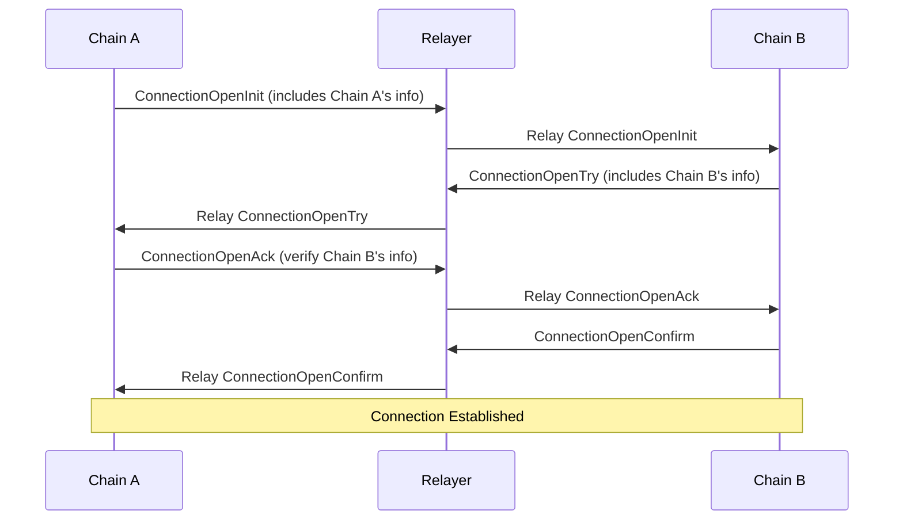

# Connections

At the beginning of the lifecycle of communication between two chains, a connection must be opened. This is a process by which one chain initiates the opening of the connection, and the other responds with certain data. We call this process a 4-way handshake, as each chain must send two messages. The handshake is used to bootstrap the connection, exchanging critical information such as the current validator set, chain identifier, and consensus mechanism. This data is stored on both chains and, once the handshake is completed, used for verifying future cross-chain messages.

During this handshake:

1. Chain A initiates with ConnectionOpenInit, sending its chain-specific parameters
1. Chain B responds with ConnectionOpenTry, verifying Chain A's data and providing its own
1. Chain A acknowledges with ConnectionOpenAck, confirming Chain B's information
1. Chain B finalizes with ConnectionOpenConfirm, establishing the secure connection

Once established, this connection can be used for secure cross-chain communication, with both chains able to verify messages using the exchanged parameters and consensus proofs.

This connection effectively acts as a socket to read and write bytes between the two chains. Although this is powerful, we ideally want a more structured way to communicate, akin to HTTP. For that we use channels.
