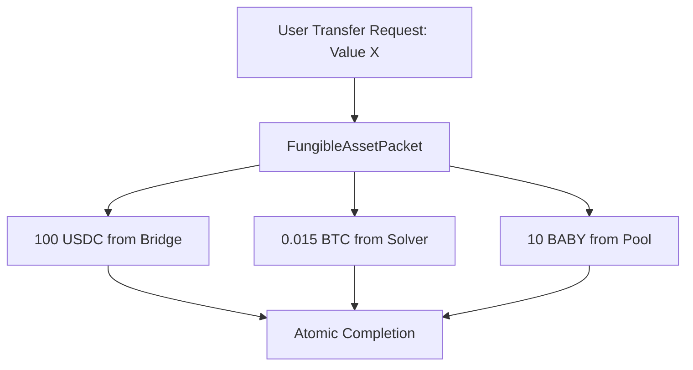

# Open Filling

## Traditional Bridge Models

Traditional bridge protocols typically handle transfers through a single mechanism per token:

- **Mint/Burn**: The bridge mints a specific token on the destination chain
- **Locked Pools**: Assets are locked in token-specific pools
- **Solver Networks**: Solvers provide liquidity for particular tokens

Each model handles one token type at a time, requiring multiple separate transfers for different assets, and quite often requiring users to switch between various bridges.

One step forward in making the bridge model more flexible, is to separate the relaying of information from the actual fulfillment of an order. The bridge protocol focuses on providing the initial data and relaying the acknowledgement, while different implementations can exist to actually provide the assets. We refer to this model as open filling.

We shall see that open filling has advantages in flexibility and can make better use of local optimizations. On some chains, liquidity pools may be abundant, while on others, the solver market is more mature. Open filling allows bridges to adjust to these market realities.

## Open Filling

Union introduces "open filling" where the assets in a transfer can be provided in various ways, while still guaranteeing the atomic execution of the packet:

1. A single transfer can include multiple different tokens
1. Each token can use its own fill mechanism
1. All fills are composed atomically in one transaction



Besides flexibility, open filling can be used to implement features which traditionally we do not consider a core bridging service. One such feature we already encountered: [gas station](union/packets). We could also leverage this to implement an exchange, by specifying non-equivalent base and quote assets:

```solidity
FungibleAssetOrder { baseToken: USD baseTokenAmount: 100000, quoteToken: BTC, quoteTokenAmount: 1 },
```

Given this order, the only way to fill is for the relayer to either swap USD in a dex for BTC, or to provide 1BTC itself and keep the $100,000. With open filling, we do not care about the implementation detail (and can support both at the same time).
