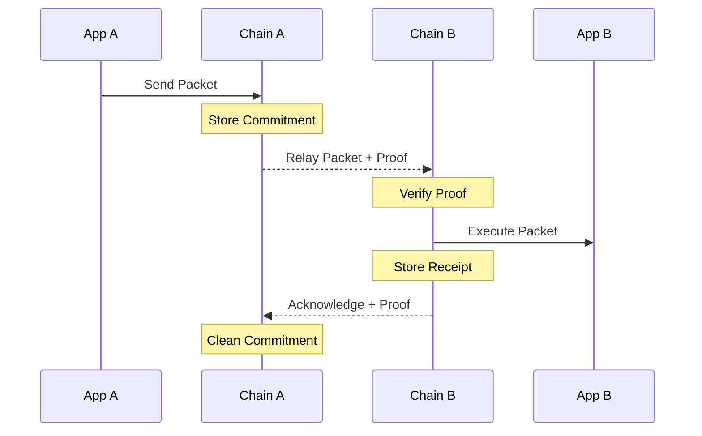

# Packets

Packets are the unit of cross-chain communication that carry application data through established channels. For unordered channels, packets can be delivered in any sequence, making them ideal for applications where message ordering isn't critical. Union specifically chose not to support ordered channels due to their poor performance during congestion and incompatibility with fee markets.



Each packet contains:
- Source channel
- Destination channel
- Timeout height or timestamp
- Data payload

Packet Lifecycle:
1. Application sends data through its channel
2. Source chain stores a commitment to the packet
3. Relayer delivers packet and proof to destination
4. Destination verifies and executes packet
5. Relayer returns acknowledgment to source
6. Source chain cleans up the commitment

Timeouts prevent packets from being permanently stuck if the destination chain halts or refuses to process them. When a timeout occurs, the source chain reclaims the packet and notifies the sending application.

## ucs01-zkgm

Union leverages a specialized channel with packet data for asset transfers. While analogous to ics01 in legacy IBC chains, it offers several advantages:

- Multi-Asset transfers
- Open Filling
- Ahead of Finality (AoF) filling
- Routing for GMP

The packet schema functions as a small program with various instructions executed by the IBC app:

```solidity
struct ZkgmPacket {
    bytes32 salt;
    uint256 path;
    Instruction instruction;
}

struct Instruction {
    uint8 version;
    uint8 opcode;
    bytes operand;
}
```

Instructions use ethabi encoding to structure packets or perform operations. For example, the `Forward` instruction enables packet forwarding:

```solidity
struct Forward {
    uint32 channelId;
    uint64 timeoutHeight;
    uint64 timeoutTimestamp;
    Instruction instruction;
}
```

The most common instruction is `FungibleAssetOrder`:

```solidity
struct FungibleAssetOrder {
    bytes sender;
    bytes receiver;
    bytes baseToken;
    uint256 baseAmount;
    string baseTokenSymbol;
    string baseTokenName;
    uint256 baseTokenPath;
    bytes quoteToken;
    uint256 quoteAmount;
}
```

This instruction powers the official Union app's bridging functionality. Unlike other bridges, it includes both base and quote information, enabling users to specify desired asset conversions (e.g., USDC to unionUSDC). This design allows `FungibleAssetOrder` to handle non-equivalent asset swaps when solvers provide liquidity.

### Fees

Rather than explicitly defining relayer and gas fees, `FungibleAssetOrder` incentivizes packet processing through the value difference between baseAmount and quoteAmount for equivalent assets:

```solidity
FungibleAssetOrder({
    ...
    baseToken: USDC,
    baseAmount: 100,
    quoteToken: USDC,
    quoteAmount: 99,
})
```

This example sets a 1 USDC fee independent of the destination chain's gas token. Relayers evaluate packet settlement based on profitability.

### Gas Station

The protocol addresses the common challenge of users lacking gas tokens after bridging through a composable instruction system. While some centralized bridges offer unreliable gas services, Union's approach uses the `Batch` instruction to combine multiple `FungibleAssetOrder` instructions atomically:

```solidity
struct Batch {
    Instruction[] instructions;
}
```

A transfer with gas deposit combines two orders:

```solidity
Batch({
    instructions: [
        FungibleAssetOrder { actualTransferDetails.. },
        FungibleAssetOrder { baseTokenAmount: 0, quoteToken: $GAS, quoteTokenAmount: 1 },
    ],
})
```

Relayers evaluate the batch's cumulative profit, converting gas tokens to USD value. For instance, if the first order yields 5 USD profit and the second costs 1 $GAS, relayers fulfill the packet when the net profit exceeds their threshold. The smart contract uses the relayer's balance for the gas portion, demonstrating open filling functionality.